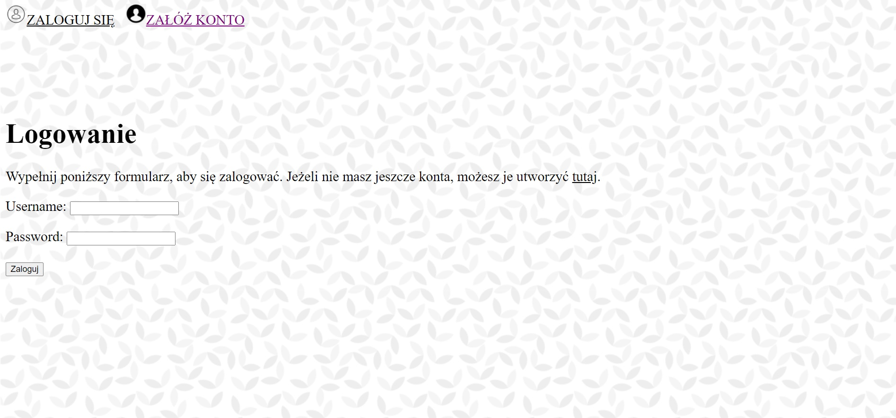
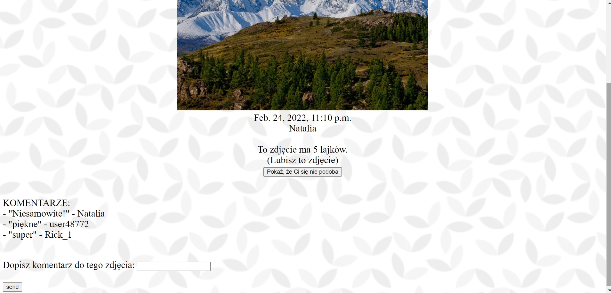
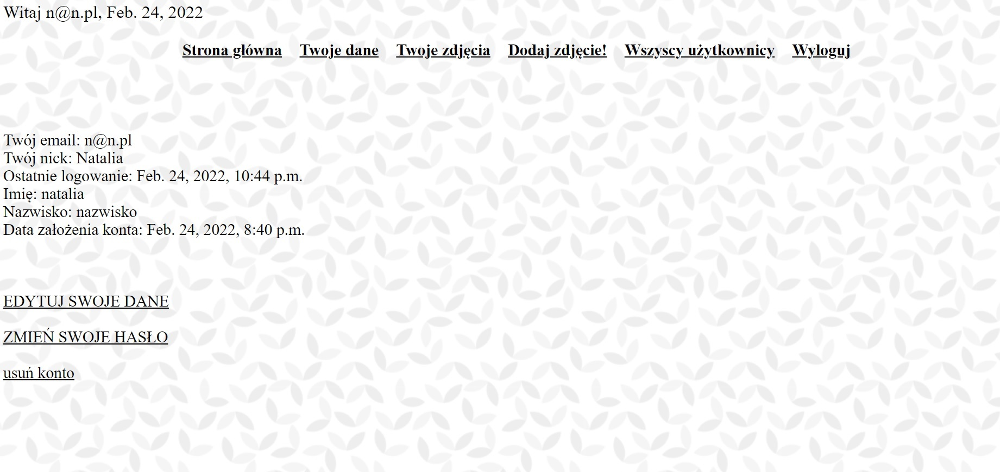
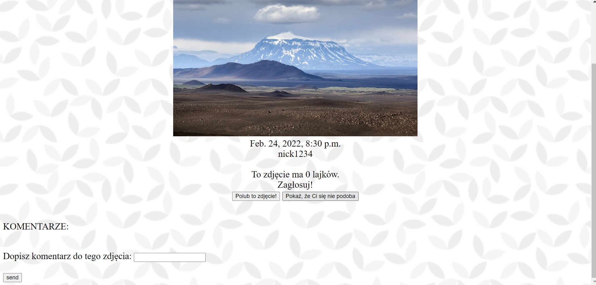

#  Photo-likes

An application that allows users to share their photos with others. 
It contains commenting mechanism, likes, basic account service, administration panel.

_Python 3.6, Django 3.0.7, psycopg2-binary 2.8.5_

&
_Python 3.10, Django 4.0.2, psycopg2-binary 2.9.3_

**Correct configuration of the file 'settings_local.py' is essential for proper use!**

###### Screenshots:
---

---

---

---

---

---

---